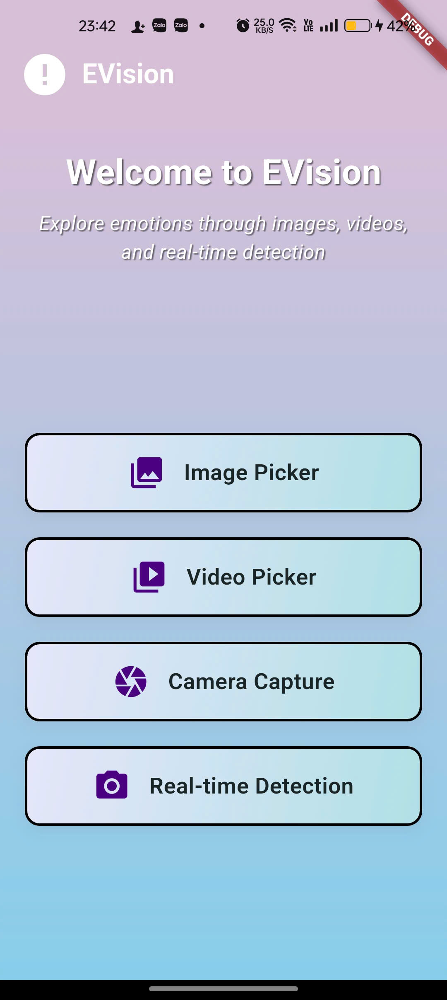
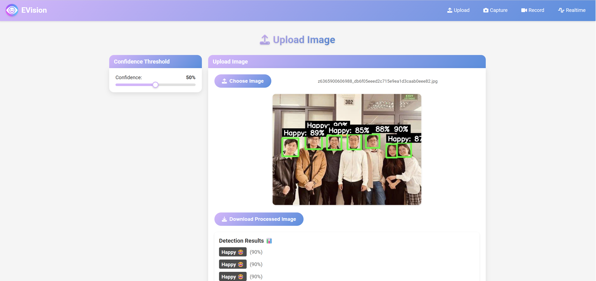
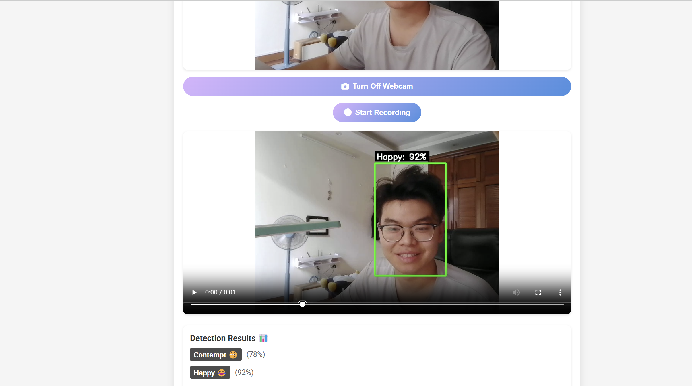

# Emotion Detection Web Application 🚀

## 🎯 Overview

**Emotion Detection Web Application** is an innovative, cross-platform tool powered by the **YOLOv12 model**, designed to detect emotions in real-time and static scenarios. Whether you're uploading images, capturing photos, recording videos, or streaming live webcam feeds, this application offers a seamless experience to analyze emotions with high accuracy. 

Integrated with a friendly **AI chatbot** powered by the Gemini API, the app provides interactive responses in **Vietnamese** and **English**, adapting to your emotions and language preferences. With a sleek, intuitive UI, customizable settings, and downloadable results, this project brings emotion detection to life! 🌟

---

## ✨ Features

- **📤 Image and Video Upload**: Upload images (JPEG/PNG) or videos (WebM/MP4) to detect emotions with annotated bounding boxes.
- **📸 Photo Capture**: Capture a photo via webcam for instant emotion analysis.
- **🎥 Video Recording**: Record videos and process them for emotion detection, with annotations added every 30 frames.
- **🌐 Real-time Detection**: Stream your webcam feed for continuous emotion detection, complete with live bounding box overlays and AI chatbot interaction.
- **🤖 Emotion-based Chatbot**: A friendly AI chatbot that responds to detected emotions in Vietnamese or English, with automatic language detection.
- **🎚️ Adjustable Confidence Threshold**: Fine-tune detection sensitivity using a slider (default: 5%).
- **💾 Downloadable Results**: Save processed images, videos, or detection results as text files.
- **🎨 Responsive Interface**: Enjoy a user-friendly UI with loading animations, notifications, and clear result displays.

---

## 📸 Screenshots

### Homepage
Discover the power of emotion detection with EVision AI! Choose your experience from a variety of intuitive tools.

### Image Upload
Upload images to detect emotions with high accuracy, featuring bounding boxes and confidence scores.

### Photo Capture
Capture a photo using your webcam and instantly analyze emotions with detailed results.

### Video Recording
Record videos via webcam and process them for emotion detection, with annotations added every 30 frames.

### Real-time Detection with Chatbot
Stream your webcam feed for real-time emotion detection and interact with our AI chatbot, which responds to your emotions in a friendly tone.

---

## 📊 Model Performance

The YOLOv12 model was trained and validated with the following performance metrics, showcasing its accuracy and robustness:

### Metrics Breakdown
- **Train Losses**: `train/box_loss`, `train/cls_loss`, `train/dfl_loss` show the model's learning progress over epochs.
- **Validation Losses**: `val/box_loss`, `val/cls_loss`, `val/dfl_loss` indicate the model's performance on unseen data.
- **Precision and Recall**: `metrics/precision(B)` and `metrics/recall(B)` demonstrate the model's ability to correctly identify emotions.
- **mAP Metrics**: `metrics/mAP50(B)` and `metrics/mAP50-95(B)` provide a comprehensive evaluation of the model's accuracy across different IoU thresholds.

---

## 🛠️ Tech Stack

- **Backend**: Flask (Python) with Flask-SocketIO for real-time communication
- **Frontend**: HTML, CSS, and JavaScript, leveraging Socket.IO for seamless real-time streaming
- **Machine Learning**: YOLOv12 model (`yolov12s.pt`) via the Ultralytics library for emotion detection
- **Libraries**:
  - OpenCV for image and video processing
  - NumPy for numerical operations
  - `langdetect` for automatic language detection of user messages
- **Chatbot**: Powered by the Gemini API for generating emotion-based responses
- **Dependencies**: All required packages are listed in `requirements.txt`

---

## 🧠 Supported Emotions

The application detects a range of emotions, each accompanied by a confidence score, an emoji, and a color-coded bounding box:

- **Anger** 😡
- **Contempt** 😏
- **Disgust** 🤢
- **Fear** 😱
- **Happy** 😂
- **Neutral** 😐
- **Sad** 😢
- **Surprised** 😲
- **Unknown** ❓ (for unrecognized emotions)

---

## 📖 Usage Scenarios

- **Static Analysis**: Upload an image or video to analyze emotions in a single moment or across a sequence of frames.
- **Instant Capture**: Take a quick photo with your webcam to see what emotions are present.
- **Video Processing**: Record a video and let the app annotate emotions frame-by-frame.
- **Live Interaction**: Stream your webcam feed, watch emotions being detected live, and chat with the AI bot based on your mood.

---

## 💬 Chatbot Interaction

The integrated chatbot enhances the user experience by responding to detected emotions in a conversational manner. Key features include:

- **Initiation**: In real-time mode, the chatbot starts a conversation after 5 seconds based on the dominant detected emotion.
- **Language Support**:
  - **Vietnamese Responses**: Uses a friendly tone with informal pronouns like "cậu-tớ" or "bạn-tôi", and lively emojis.
  - **English Responses**: Uses a casual, playful tone with teencode (e.g., "u", "bro", "lol") and emojis for a fun vibe.
- **Automatic Language Detection**: Detects the user's language to respond appropriately.

---

## 🗂️ Configuration Details

### File Structure

- **`app.py`**: Main Flask application handling routes and SocketIO events for real-time functionality
- **`src/model_loader.py`**: Loads the YOLO model for emotion detection
- **`src/emotion_detector.py`**: Processes images/videos and draws bounding boxes using OpenCV
- **`config.py`**: Stores configuration settings like model paths and API keys
- **`static/js/`**: Contains JavaScript files for frontend features
  - `upload.js`: Manages image/video uploads
  - `capture.js`: Handles webcam photo capture
  - `record.js`: Controls video recording
  - `realtime.js`: Enables real-time streaming and chatbot interaction
- **`templates/`**: HTML templates for the user interface (e.g., `index.html`, `upload.html`)
- **`uploads/`**: Directory for storing uploaded and processed files
- **`models/`**: Stores the YOLO model (`yolov12s.pt`)

### Key Configurations

- **Model**: Uses `yolov12s.pt` for emotion detection, expected to be placed in the `models/` directory
- **Uploads**: Processed files are saved in the `uploads/` directory
- **Gemini API**: Requires a valid API key for the chatbot to function
- **Confidence Threshold**: Adjustable via the UI (default: 5%) to control detection sensitivity

---

## 📝 Notes

- The YOLOv12 model must be trained or fine-tuned for emotion detection to recognize the supported emotions accurately.
- Real-time detection can be resource-intensive; ensure your system has sufficient CPU/GPU resources.
- The chatbot requires an active internet connection and a valid Gemini API key to operate.

---

## 🤝 Contributing

We welcome contributions! To contribute:

1. Fork the repository.
2. Create a feature branch: `git checkout -b feature/your-feature`
3. Commit your changes: `git commit -m "Add your feature"`
4. Push to the branch: `git push origin feature/your-feature`
5. Open a pull request.

---

## 📜 License

This project is licensed under the MIT License. See the `LICENSE` file for details.

---

## 📬 Contact

For questions or support, reach out to the project maintainer at [your-email@example.com].

---

⭐ **Star this repository if you find it useful!** ⭐
