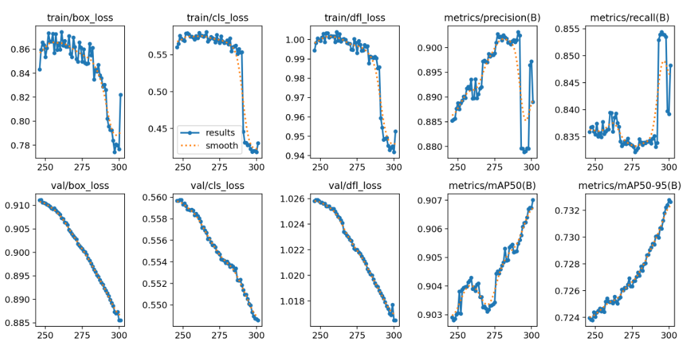

# Emotion Detection Web Application

## Introduction

The **Emotion Detection Web Application** is a state-of-the-art, cross-platform tool designed to analyze human emotions in both real-time and static contexts. Powered by the advanced **YOLOv12 model**, this application enables users to detect emotions through image uploads, video recordings, webcam captures, or live streaming. Integrated with an intelligent **AI chatbot** driven by the Gemini API, the app delivers interactive, emotion-based responses in **Vietnamese** and **English**, enhancing user engagement. With its intuitive interface, customizable settings, and downloadable results, this project provides a robust and user-friendly solution for emotion analysis, suitable for personal, research, or professional applications.

---

## YOLOv12 Model: Detailed Overview and Comparison

### YOLOv12 Overview
The **YOLOv12 model**, developed by Ultralytics, is a cutting-edge object detection framework optimized for high accuracy and efficiency in emotion detection. As an evolution of its predecessors, YOLOv12 incorporates architectural advancements, enhanced training methodologies, and optimized inference pipelines, making it ideal for real-time applications. The model used in this application (`yolov12s.pt`) is fine-tuned to detect a range of emotions, including **Anger**, **Contempt**, **Disgust**, **Fear**, **Happy**, **Neutral**, **Sad**, **Surprised**, and **Unknown**, each accompanied by a confidence score, emoji, and color-coded bounding box.

Key features of YOLOv12 include:
- **Enhanced Accuracy**: Improved feature extraction and loss functions enable precise detection of subtle emotional cues.
- **Real-time Performance**: Optimized for low-latency inference, supporting live webcam streaming.
- **Scalability**: The lightweight `yolov12s.pt` model balances performance and resource efficiency, enabling deployment on diverse hardware.
- **Robustness**: Trained on varied datasets, YOLOv12 generalizes effectively across different lighting, angles, and facial expressions.

### Performance Metrics
The YOLOv12 model showcases strong performance, as illustrated by the following metrics:

- **Training Losses**: Metrics like `train/box_loss`, `train/cls_loss`, and `train/dfl_loss` reflect the model's learning progress over epochs.
- **Validation Losses**: `val/box_loss`, `val/cls_loss`, and `val/dfl_loss` demonstrate reliable performance on unseen data.
- **Precision and Recall**: High `metrics/precision(B)` and `metrics/recall(B)` scores confirm accurate emotion identification.
- **mAP Metrics**: `metrics/mAP50(B)` and `metrics/mAP50-95(B)` provide a comprehensive evaluation of detection accuracy across IoU thresholds.

### Comparison with Previous Models
Compared to earlier YOLO versions (e.g., YOLOv8, YOLOv10), YOLOv12 offers distinct advantages:
- **Higher Accuracy**: Enhanced feature pyramid networks and attention mechanisms improve detection of fine-grained emotional features compared to YOLOv8.
- **Faster Inference**: Optimized convolutional layers reduce latency, surpassing YOLOv10 in real-time applications.
- **Lower Resource Usage**: The `yolov12s.pt` variant is more lightweight than YOLOv8’s larger models, ideal for resource-constrained environments.
- **Better Generalization**: Advanced data augmentation and training strategies make YOLOv12 more robust to diverse inputs than its predecessors.

While YOLOv12 may require more initial training time due to its complex architecture, its superior accuracy and real-time capabilities make it the optimal choice for this emotion detection application.

---

## Web Application Features

The Emotion Detection Web Application offers a comprehensive set of features designed for versatility and user engagement:

- **Image and Video Upload**: Upload images (JPEG/PNG) or videos (WebM/MP4) to detect emotions, with results displayed as annotated bounding boxes and confidence scores.
- **Photo Capture**: Capture photos via webcam for instant emotion analysis, with clear result presentations.
- **Video Recording**: Record videos using a webcam and process them for emotion detection, with annotations added every 30 frames.
- **Real-time Detection**: Stream live webcam feeds for continuous emotion detection, featuring live bounding box overlays and real-time AI chatbot interaction.
- **Emotion-based AI Chatbot**: An integrated chatbot responds to detected emotions in a conversational tone, supporting **Vietnamese** (friendly, informal tone with emojis) and **English** (casual, playful tone with teencode). It uses automatic language detection to adapt to user inputs.
- **Adjustable Confidence Threshold**: Customize detection sensitivity via a slider (default: 5%) to balance precision and recall.
- **Downloadable Results**: Save processed images, videos, or detection summaries as text files for further use.
- **Responsive Interface**: A modern, user-friendly UI with loading animations, notifications, and clear result displays ensures a seamless experience across devices.

---

## Screenshots

### Homepage
Discover the power of emotion detection with EVision AI! Choose your experience from a variety of intuitive tools.

### Image Upload
Upload images to detect emotions with high accuracy, featuring bounding boxes and confidence scores.

### Photo Capture
Capture a photo using your webcam and instantly analyze emotions with detailed results.

### Video Recording
Record videos via webcam and process them for emotion detection, with annotations added every 30 frames.

### Real-time Detection with Chatbot
Stream your webcam feed for real-time emotion detection and interact with our AI chatbot, which responds to your emotions in a friendly tone.

---

## Conclusion

The **Emotion Detection Web Application** harnesses the power of **YOLOv12** and the Gemini API to deliver a robust, interactive, and user-centric tool for emotion analysis. With its versatile feature set—spanning static image analysis, real-time webcam streaming, and AI-driven chatbot interactions—this application is a powerful solution for both casual and professional use cases. The YOLOv12 model’s exceptional accuracy and efficiency, paired with a responsive web interface, position this project as a significant advancement in emotion detection technology.

We encourage users to explore the application, contribute to its development, and share feedback to further enhance its capabilities. Whether for personal exploration, academic research, or industry applications, this project provides an engaging and effective way to understand human emotions.

---

## Contributing

Contributions are welcome! To contribute:
1. Fork the repository.
2. Create a feature branch: `git checkout -b feature/your-feature`
3. Commit your changes: `git commit -m "Add your feature"`
4. Push to the branch: `git push origin feature/your-feature`
5. Open a pull request.

---

## License

This project is licensed under the MIT License. See the `LICENSE` file for details.

---

## Contact

For questions or support, contact the project maintainer at [khanhnhim21102004@gmail.com].

---

⭐ **Star this repository if you find it useful!** ⭐
